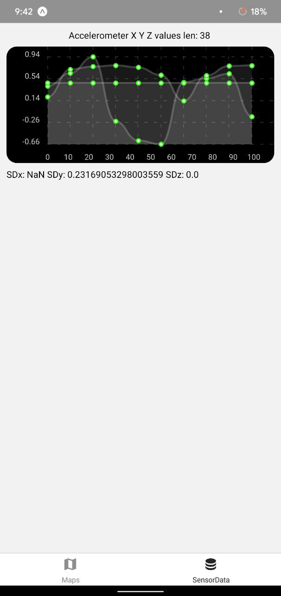
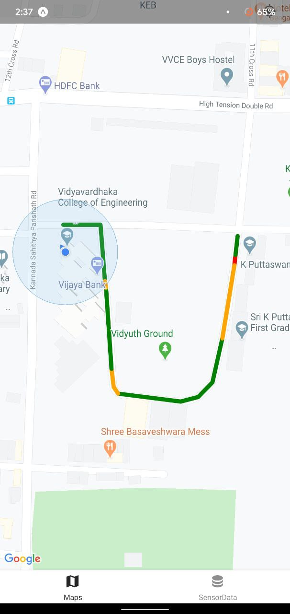

# Hey! This is Road-Maps
Its a new age map for developing countries which takes into account road conditions while selecting the route between you and your destination.

## Track - Open Innovation

## Check out the demo at the youtube link below
https://youtu.be/IKF3uPlRoXU

## React-Native
Contains all the react-native code to run the app.
Install expo and run <i>expo run</i> on the terminal

## Python + Flask
Contains all the python training and testing code.
You can also find the flask server code.

## Screeshots
Real Time Accelerometer data from phone sensor
 
 

Mapped road conditions
 
 

In real life, depressions in roads come up in the map as orange regions
 
 

